# NeuWid_Abschlussprojekt

## Projektbeschreibung
Das folgende Projekt dient der Auswertung beliebiger ebener Mechanismen, welche vier Einschränkungen besitzen. 
```
1. Es werden nur ebene Mechanismen betrachtet
2. Nur Drehgelenke sind mit starren Gliedern verbunden
3. Nur ein Drehgelenk dient als Antrieb
4. Ein Gelenk ist fest verankert
```
Es werden Winkel im Bereich von 0° bis 360° betrachtet.

## Installation
Um das Projekt als Code zu verwenden, müssen folgende Schritte durchgeführt werden:
1. Das [GitHub-Repository](https://github.com/np362/NeuWid_Abschlussprojekt) klonen  
2. Die benötigten Bibliotheken installieren:
   ```bash
   pip install -r requirements.txt
   ```
3. Das Projekt kann nun verwendet werden.

Um das Projekt über die Streamlit-App zu verwenden, müssen folgende Schritte durchgeführt werden:
1. Den Link zu unserer [Streamlit-App](https://neuwidproject.streamlit.app/) aufrufen  
2. Die App kann nun verwendet werden.


## Ablauf des Programms
Die Berechnung läuft nach folgendem Ablaufschema ab:

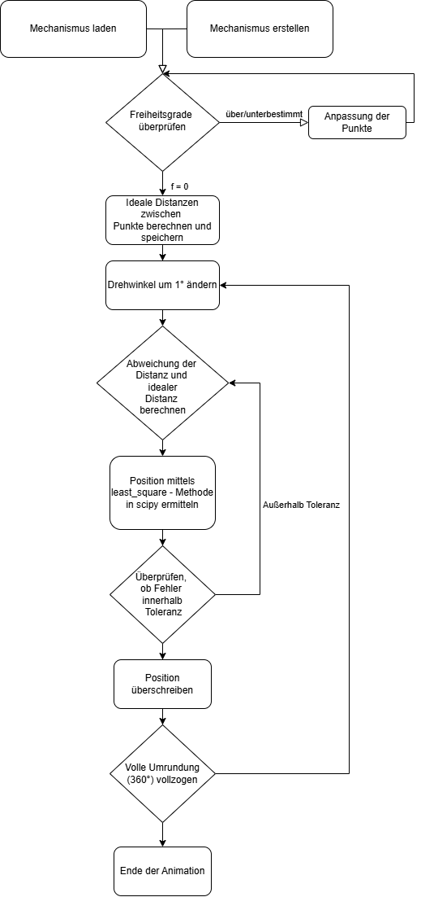

Zuerst erfolgt das Laden/Erstellen des Mechanismus durch den Benutzer. Dann wird von der Software überprüft, ob das System statisch bestimmt ist. 

Wenn nicht, so muss der Benutzer Änderungen an den Einstellungen treffen. Wenn das System valide ist, dann werden die euklidischen Distanzen zwischen den Punkten berechnet und diese dann als gewünschte Distanzen (im Code desDist) gespeichert. 
Nach der Berechnung wird der Winkel der Antriebskurbel um 1° erhöht. 
Dadurch verändern sich die Distanzen zwischen den Punkten (erstmals nur die Distanzen von Punkten, die mit dem Kurbelantrieb zusammenhängen). 

Mittels der least_square()-Funktion des scipy Moduls, werden dann die Positionen so optimiert, dass die Längenänderungen innerhalb einer in der Funktion festgelegten Toleranz liegen. Wenn die Positionen aller beweglichen Punkte angepasst wurden, wird der Winkels des Kurbelantriebs erneut um 1° erhöht.

## Berechnung

Für die Berechnung im Programm wurden folgende Klassen verwendet. 

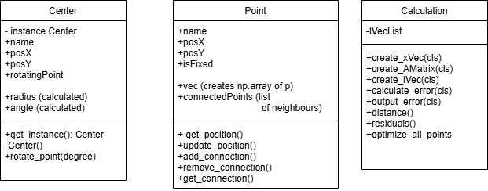

Die Klasse Center wurde als Singleton realisiert, da nur ein Kurbelantrieb für den Mechanismus vorgesehen ist. 
Das Attribut rotatingPoint ist derjenigen Punkt, der in einer Kreisbahn um den Punkt Center rotieren soll. 
Die Methode nimmt den Integer degree entgegen, der den aktuellen Winkel um diesen Wert erhöht. 

Die Klasse Point hat das Attribut vec, dass ein np.array() mit den Positionen erstellt. Dies wird für weitere Berechnungen benötigt.
add_connection() nimmt den Punkt entgegen, mit dem der Punkt in der Grafik als verbunden dargestellt werden soll. 

In der Klasse Calculation werden die Berechnungen durchgeführt. Die Methoden create_xVec(), create_AMatrix(), create_lVec() entsprechen den Rechenschritten im Skript. Mit calculate_error() wird die Längendifferenzen der derzeitigen und vorherigen Iteration, im Skript mit dem Vektor e gekennzeichnet, berechnet. output_error() fasst alle diese Methoden zusammen, für einfachere Handhabung. 

In distance() wird die euklidische Distanz zwischen zwei Punkten berechnet und zurückgegeben. 

Die Methode residuals() berechnet die Differenz von den tatsächlichen und den gewünschten Distanzen und gibt sie als Liste zurück.

Die finale Methode ist optimize_all_points(). 
Diese nimmt eine Liste mit allen Punkten (mit Ausnahme Center) und Tuples mit den Punktepaaren und deren Distanz als Parameter. Hierbei ist zu beachten, dass ein fixierter Punkt bzw. der rotierende Punkt als zweites Argument im Punktepaar angegeben werden muss. 

Die Toleranz und Anzahl an Iterationen sind in der Methode als Standardparameter gesetzt. Die Funktion iteriert über die Liste der Punkte und überprüft, welche Punkte fixiert oder lose sind. 

Die Methode least_squares wird verwendet, um die Position von p1 zu optimieren. Dabei werden die Residuen berechnet, basierend auf der aktuellen Position und den gewünschten Distanzen zu p2. 
Die Position von p1 wird mit den optimierten Werten aktualisiert.
 
Der Fehler wird als absolute Differenz zwischen der aktuellen und der gewünschten Distanz berechnet und mit dem max_error verglichen. Wenn der aktuelle Fehler größer ist, wird max_error entsprechend aktualisiert.


## Anwendung
Der Mechanismus kann durch Eingabe von Punkten mit deren Koordinaten in eine Tabelle oder durch Laden eines bereits bestehendem Mechanismus erstellt werden. 

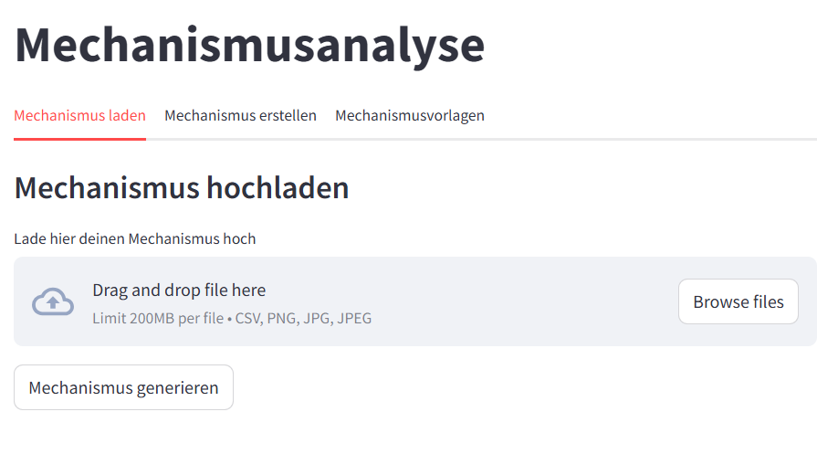

Der Mechanismus wird dann in einem Koordinatensystem dargestellt. Die Eingabe sowie die Ausgabe erfolgen für den Nutzer über die Streamlit-App.  

Mit dem Button "Zwei Zeilen tauschen" kann die Anordnung der Punkte in der Tabelle geändert werden. Dadurch kann man unerwünschte Verbindungen überarbeiten oder mühsam die einzelnen Werte austauschen zu müssen.

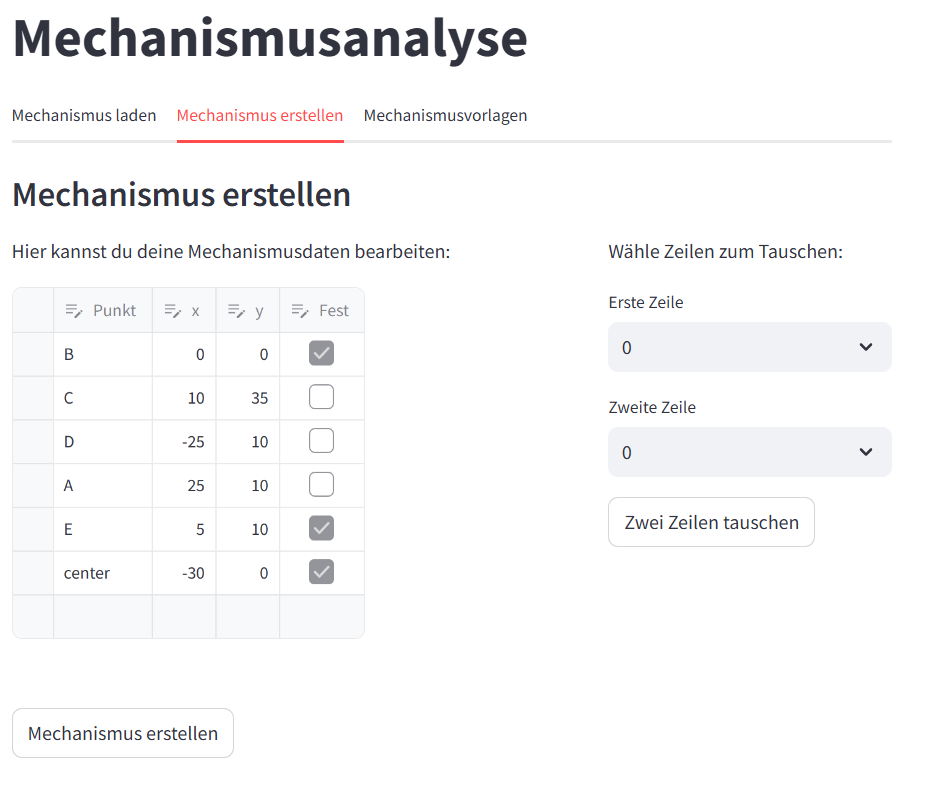

Sobald der Mechanismus erstellt wurde, kann dieser gespeichert werden. Durch anklicken des Knopfes "Download plot as png" in der Figur selbst, wird der Mechanismus als PNG-Datei gespeichert. Wenn beim Abspielen der Animation der Button "Pause" betätigt wird, kann der Mechanismus an einer beliebigen Stelle gespeichert werden.

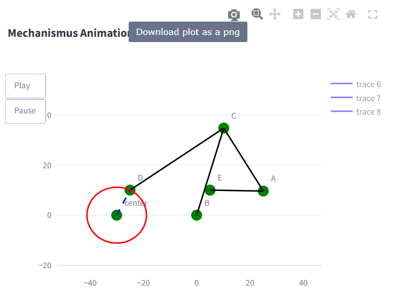

Um das Erstellen eines Mechanismus zu vereinfachen wurden Vorlagen eingefügt, welche durch einen Klick auf den Button "Vorlage" geladen werden können.

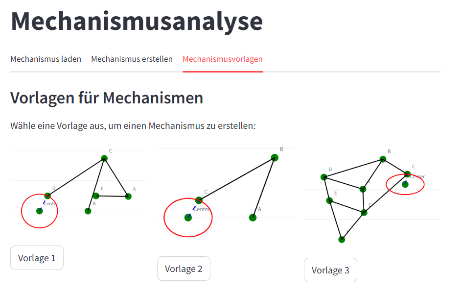

Der Mechanismus wird hierbei nicht nur angezeigt, sondern kann auch gespeichert werden. Des Weiteren kann der Mechanismus auch animiert werden. 

Hierbei wird der Mechanismus in verschiedenen Stellungen dargestellt, sodass der Nutzer die Bewegung des Mechanismus nachvollziehen kann. 

So kann auch die Bahnstrecke eines gewählten Punktes, sofern dieser nicht statisch ist, gespeichert werden.


Der Mechanismus und die Bahnkurve kann auch als CSV-Datei gespeichert werden. Hierbei wird der Mechanismus in einer Tabelle dargestellt, sodass der Nutzer die Koordinaten der Punkte und die Verbindungen einsehen kann. Bei der Bahnkurve wird zudem der jeweilige Winkel der einzelnen Punkte des Mechanismus angezeigt.

Die csv-Datei des Mechanismus kann auch wieder geladen werden, sodass der Mechanismus nicht erneut eingegeben werden muss.

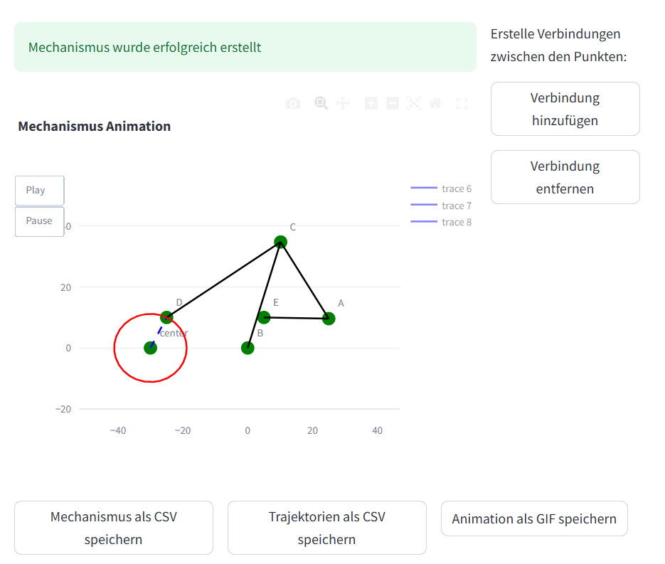

Zudem können Verbindungen hinzugefügt oder entfernt werden. Dies ist vorallem dann anzuwenden, wenn der Mechanismus unterdefiniert ist und der Nutzer nach der Eingabe von Punkten noch Verbindungen hinzufügen muss. 

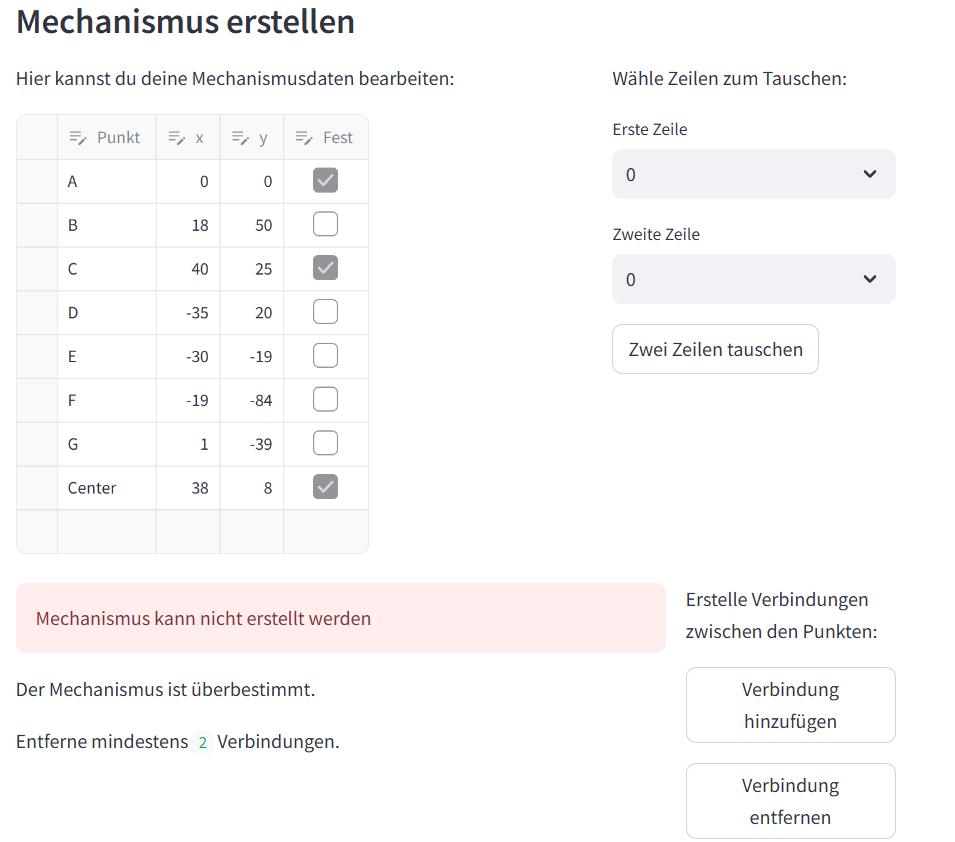 

In der Sidebar kann der Nutzer den Inertialwinkel des Mechanismus einstellen.   Dieser Winkel gibt an, in welcher Position sich der Mechanismus befindet. Außerdem werden in der Sidebar alle im Moment bestehenden Verbindungen angezeigt.

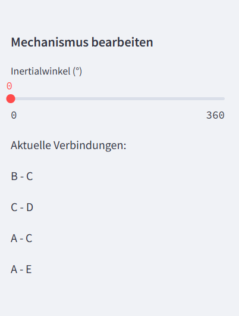

Der Nutzer kann Bilder eines Mechanismus hochladen, welche mittels Bilderkennung in Punkte und Verbindungen umgewandelt werden. Hierbei wird das Bild in ein Koordinatensystem umgewandelt, sodass der Mechanismus dargestellt werden kann.
Der Button "Bild anzeigen" dient der Veranschaulichung der Bilderkennung, sowie der Erkennung von Fehlern, welche dadurch einfacher sind zu erkennen und beheben.

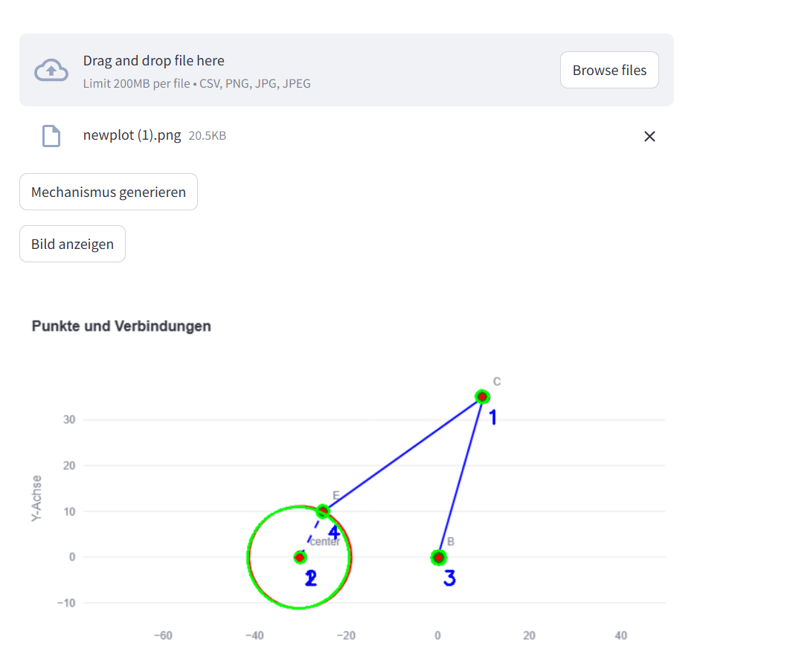

Der Nutzer kann von seinem Mechanismus eine GIF-Datei erstellen lassen. Diese dauert allerdings einige Zeit, da die Bilder des Mechanismus erstellt und dann zu einem GIF zusammengefügt werden müssen.

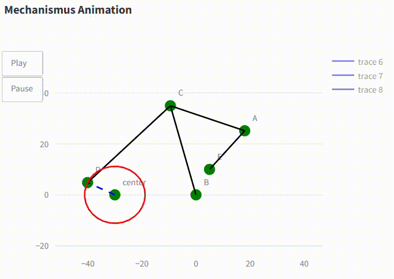


