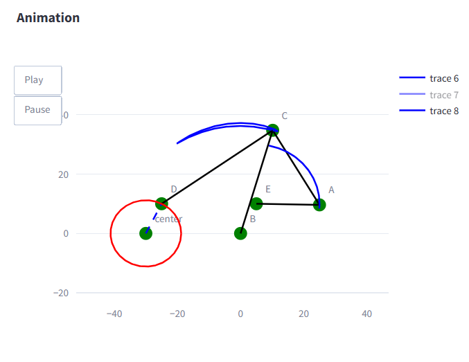

# NeuWid_Abschlussprojekt

## Projektbeschreibung
Das folgende Projekt dient der Auswertung beliebiger ebener Mechanismen, welche vier Einschränkungen besitzen. 
```
1. Es werden nur ebene Mechanismen betrachtet
2. Nur Drehgelenke sind mit starren Gliedern verbunden
3. Nur ein Drehgelenk dient als Antrieb
4. Ein Gelenk ist fest verankert
```
Es werden Winkel im Bereich von 0° bis 360° betrachtet.

## Installation
Um das Projekt als Code zu verwenden, müssen folgende Schritte durchgeführt werden:
1. Das [GitHub-Repository](https://github.com/np362/NeuWid_Abschlussprojekt) klonen  
2. Die benötigten Bibliotheken installieren:
   ```bash
   pip install -r requirements.txt
   ```
3. Das Projekt kann nun verwendet werden.

Um das Projekt über die Streamlit-App zu verwenden, müssen folgende Schritte durchgeführt werden:
1. Den Link zu unserer [Streamlit-App](https://neuwidproject.streamlit.app/) aufrufen  
2. Die App kann nun verwendet werden.

## Anwendung
Der Mechanismus kann durch Eingabe von Punkten mit deren Koordinaten in eine Tabelle oder durch Laden eines bereits bestehendem Mechanismus erstellt werden. 


Der Mechanismus wird dann in einem Koordinatensystem dargestellt. Die Eingabe sowie die Ausgabe erfolgen für den Nutzer über die Streamlit-App.  

Mit dem Button "Zwei Zeilen tauschen" kann die Anordnung der Punkte in der Tabelle geändert werden. Dadurch kann man unerwünschte Verbindungen überarbeiten oder mühsam die einzelnen Werte austauschen zu müssen.


Sobald der Mechanismus erstellt wurde, kann dieser gespeichert werden. Durch anklicken des Knopfes "Download plot as png" in der Figur selbst, wird der Mechanismus als PNG-Datei gespeichert. Wenn beim Abspielen der Animation der Button "Pause" betätigt wird, kann der Mechanismus an einer beliebigen Stelle gespeichert werden.


Um das Erstellen eines Mechanismus zu vereinfachen wurden Vorlagen eingefügt, welche durch einen Klick auf den Button "Vorlage" geladen werden können.


Der Mechanismus wird hierbei nicht nur angezeigt, sondern kann auch gespeichert werden. Des Weiteren kann der Mechanismus auch animiert werden. 

Hierbei wird der Mechanismus in verschiedenen Stellungen dargestellt, sodass der Nutzer die Bewegung des Mechanismus nachvollziehen kann. 

So kann auch die Bahnstrecke eines gewählten Punktes, sofern dieser nicht statisch ist, gespeichert werden.



Der Mechanismus und die Bahnkurve kann auch als CSV-Datei gespeichert werden. Hierbei wird der Mechanismus in einer Tabelle dargestellt, sodass der Nutzer die Koordinaten der Punkte und die Verbindungen einsehen kann. Bei der Bahnkurve wird zudem der jeweilige Winkel der einzelnen Punkte des Mechanismus angezeigt.

Die csv-Datei des Mechanismus kann auch wieder geladen werden, sodass der Mechanismus nicht erneut eingegeben werden muss.


Zudem können Verbindungen hinzugefügt oder entfernt werden. Dies ist vorallem dann anzuwenden, wenn der Mechanismus unterdefiniert ist und der Nutzer nach der Eingabe von Punkten noch Verbindungen hinzufügen muss. 

 

In der Sidebar kann der Nutzer den Inertialwinkel des Mechanismus einstellen.   Dieser Winkel gibt an, in welcher Position sich der Mechanismus befindet. Außerdem werden in der Sidebar alle im Moment bestehenden Verbindungen angezeigt.


Der Nutzer kann Bilder eines Mechanismus hochladen, welche mittels Bilderkennung in Punkte und Verbindungen umgewandelt werden. Hierbei wird das Bild in ein Koordinatensystem umgewandelt, sodass der Mechanismus dargestellt werden kann.
Der Button "Bild anzeigen" dient der Veranschaulichung der Bilderkennung, sowie der Erkennung von Fehlern, welche dadurch einfacher sind zu erkennen und beheben.


Der Nutzer kann von seinem Mechanismus eine GIF-Datei erstellen lassen. Diese dauert allerdings einige Zeit, da die Bilder des Mechanismus erstellt und dann zu einem GIF zusammengefügt werden müssen.


